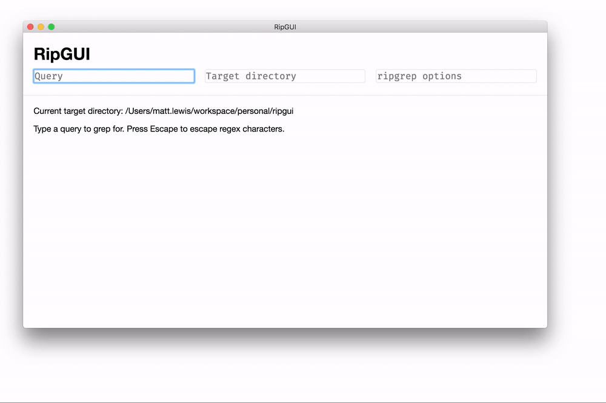

# RipGUI

A GUI for [Ripgrep](https://github.com/BurntSushi/ripgrep). Built with
[electron-vue](https://github.com/SimulatedGREG/electron-vue).



# Features

* Graphical user interface
* Auto-escape regex characters
* Click search results to open files

# Usage

```bash
# install dependencies
brew install ripgrep
yarn install

# serve with hot reload at localhost:9080
yarn dev

# build electron application for production
yarn build

# run unit & end-to-end tests
yarn test
# or just the unit test server
yarn unit

# lint all JS/Vue component files in `src/`
yarn lint
```

# Roadmap

* Dropdown history
  * with persistence between runs
* Filetype include/exclude GUI
  * and other Ripgrep options
* Automated testing
* Automated releases

# Known bugs

* Weird bad-filename-with-parens parsing
* Hitting Escape a few times blows up the input and hangs the app

# License

MIT
